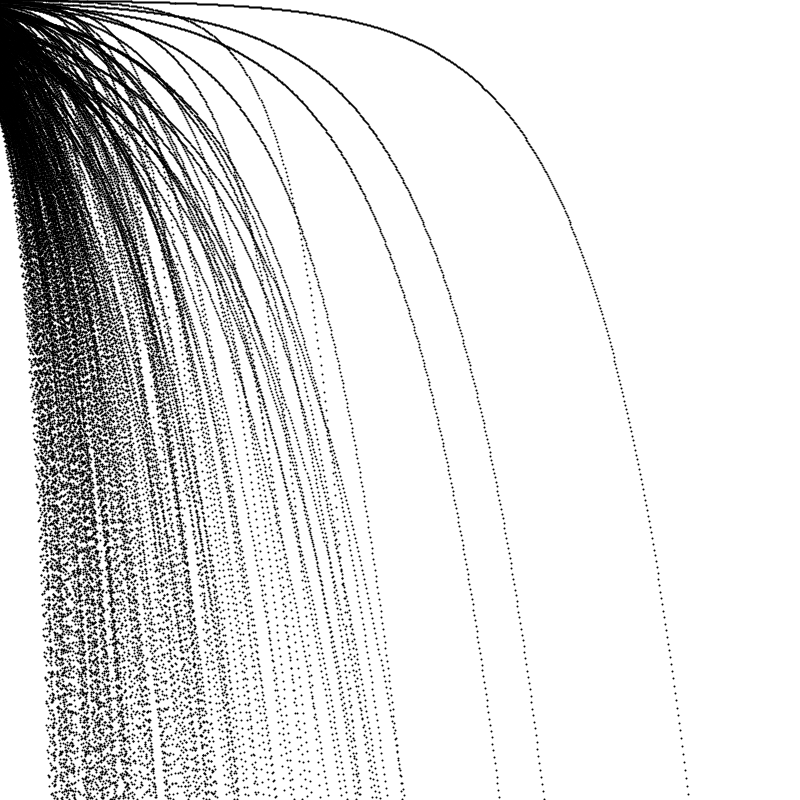

This is just a test sketch showing the creation of curves using some calculus principles: accelerations, speeds, arithmetic and geometric progression

Taken from Ira Greenberg's creative coding and computational art, 2nd edition. p.280 (ebook).

