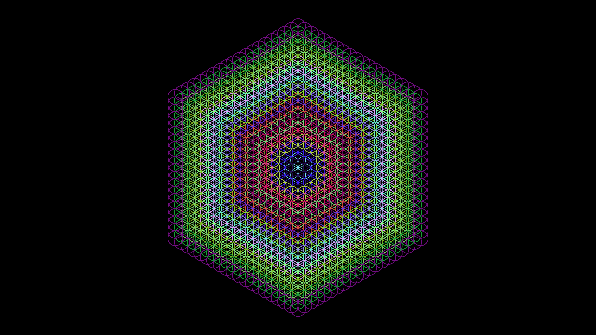

This beautiful pattern is called Flower of Life, but guess what, It has a relationship with the Asanoha pattern (Asa no ha).

I found a tutorial on how to draw the asanoha pattern with compass and rule and they start with just circles and ends up with the Asanoha pattern. 

This is the recreation of the first seccions of the flower of life. Later I will complete the whole of the space and do it in a way that its growth would be interactive.

Result >

References:

