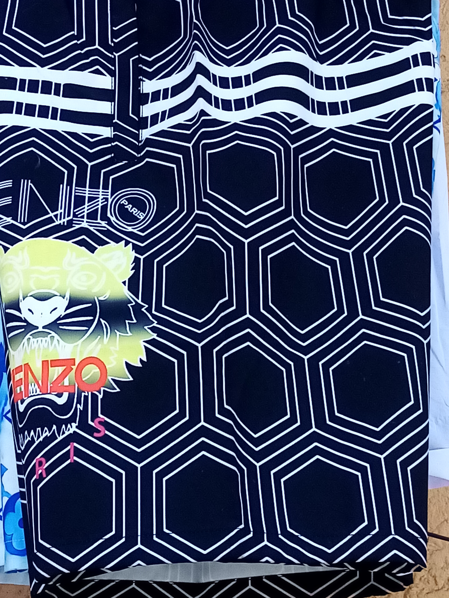
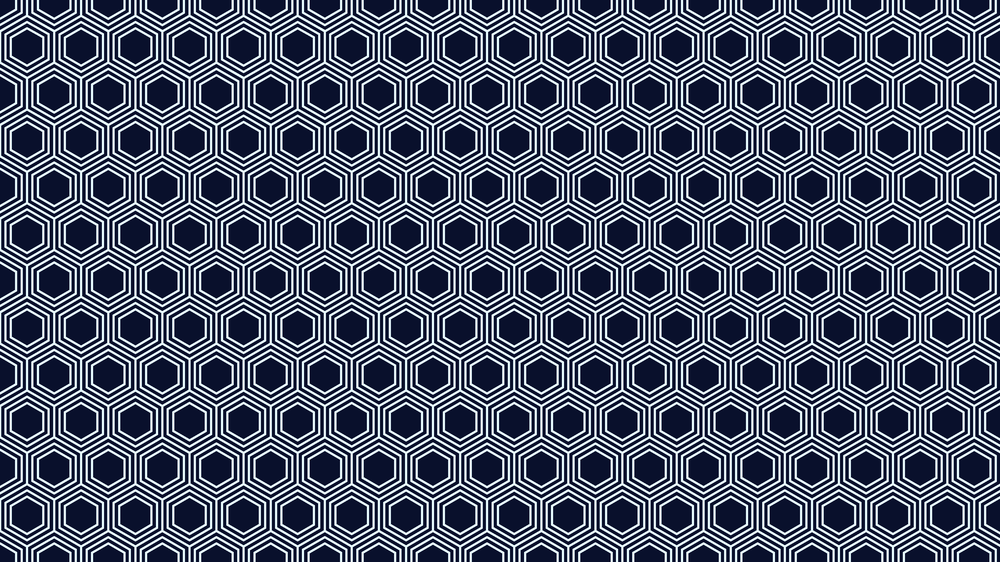

Here is an example of how you can create an hexagonal pattern using exclusively two for loops. No nonsense of using pushMatrix() and popMatrix() bullshit. 

I have managed to get the correct solution by using trig and putting special attention to discern what constitutes a step when one go for one hex to another.

Well, in any case I took inspiration on a textile I saw, so I just recreated it. 

INSPIRATION > 

RESULT >

