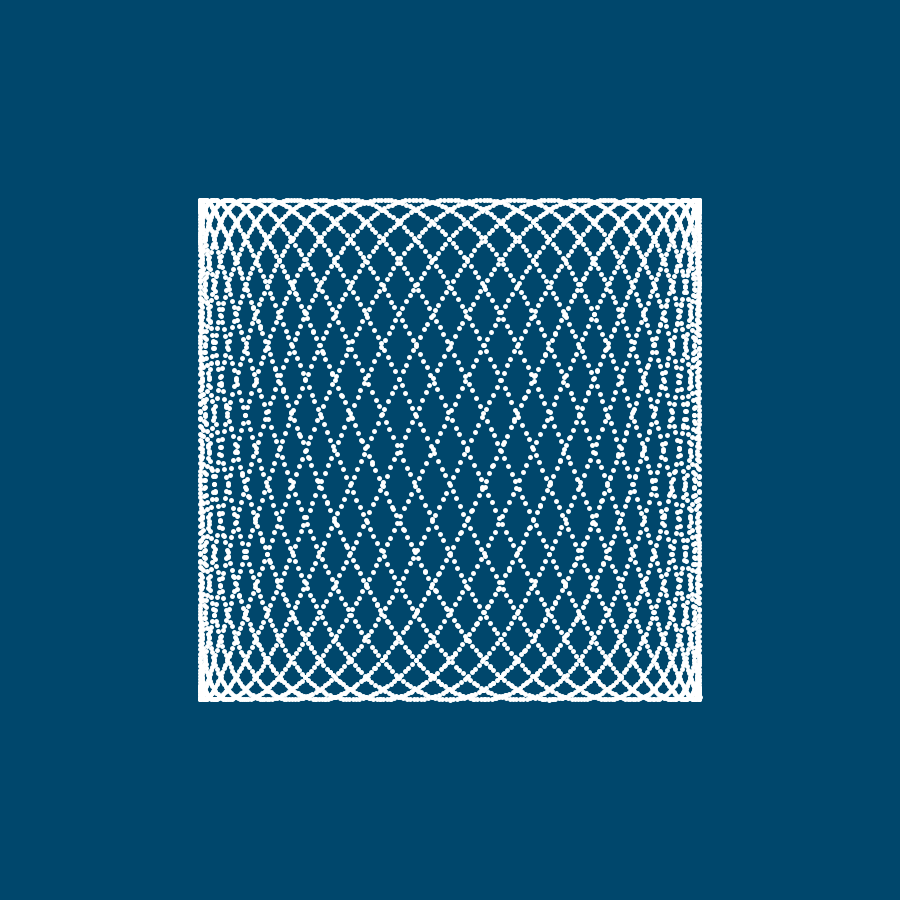

Sketch based on a youtube video I saw about how to use parametric functions to represent complex trajectories in 2D space. 
Using trigonometric lines, it is possible to constrain the movement to the area enclosed by the screen.

