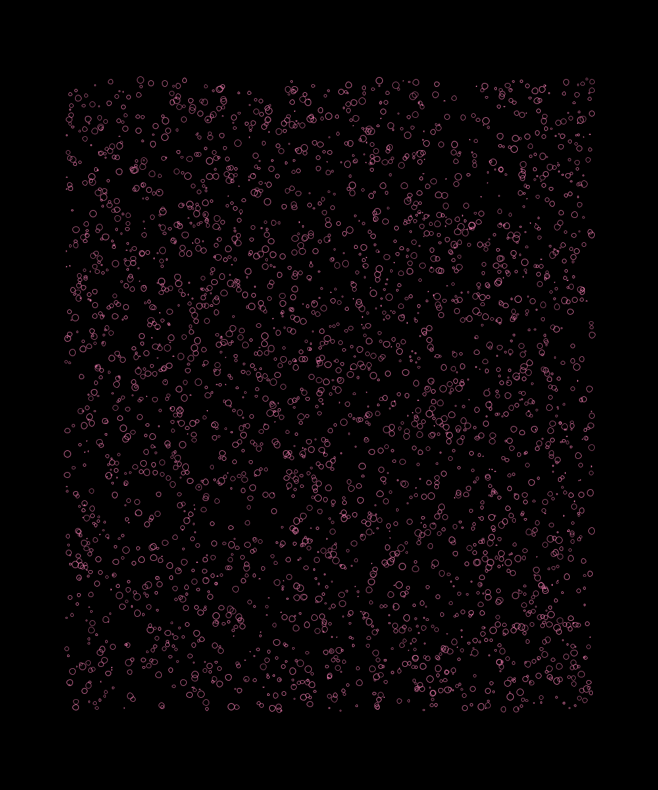

Inspired by the book Form + Code in Design, art and architecture, by Casey Reasi Chandler McWilliams and LUST.

What I want to do now is to create a landscape of escaping bubbles. Bubbles flow upwards and are created in nearly every place but, from the bottom, at random intervals and random speeds would be nice. 

The result I want is this image but dynamic.Not there yet. >

