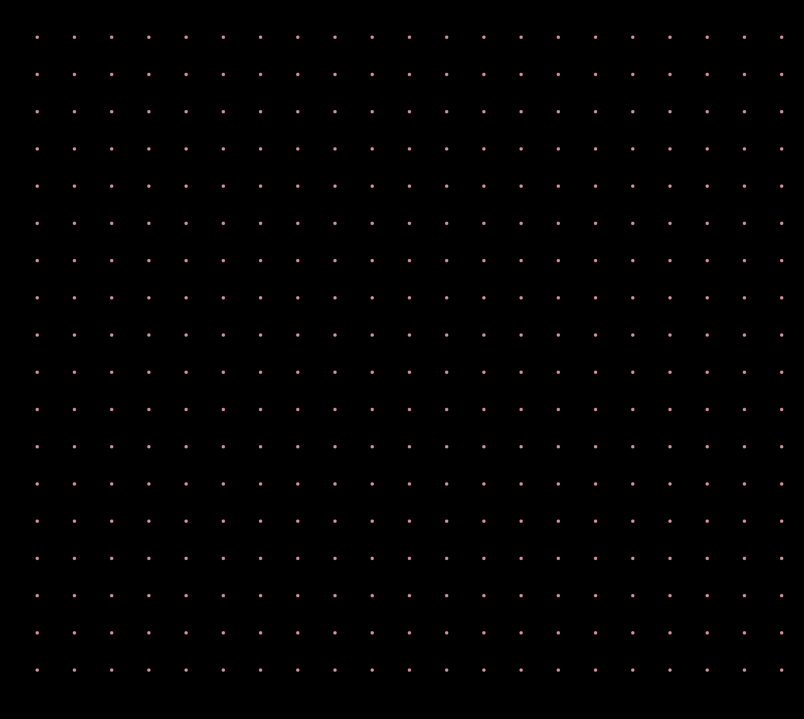

Following with the Ira Greenberg's book, I took inspiration to write a sketch showing how could I construct a grid that smoothly changes color. This is simple and beautifully pleasant. I will use it as background for my portfolio. 

Here is the result >

