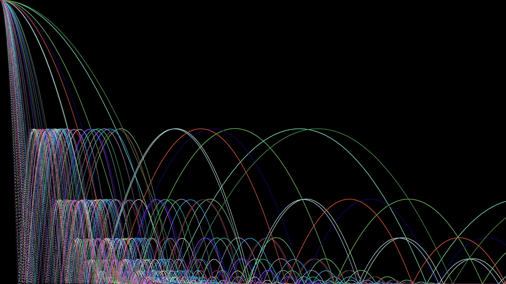

Bounces is an example presented in Ira Greenberg's book Creative coding and computational art ed. 2. (ebook's page 282)

I took the general idea and then just typed what came to mind based on that. The idea here is to replicate the main structure of the algorithm 

RESULT >

