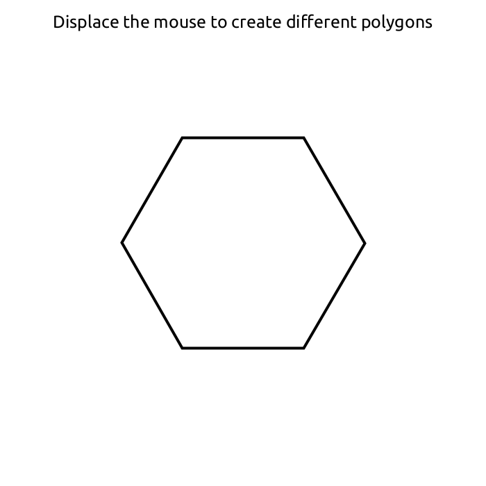

So, I'm exploring OOP concepts with the aid of this book Creative Coding and Computational Art, by Ira Greenberg(2007), and I have found that some code is simply to prove a point or explore specific concepts from programming. I want now to keep track of the page this information came from, so I can track it in a simple fashion. 

Inheritance through the use of the Shape and Polygon classes (Polygon extends Shape) and the use of their specific constructors to create a regular polygon on display. Let's see.

Result >

