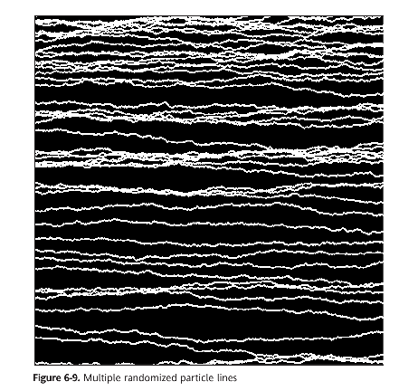
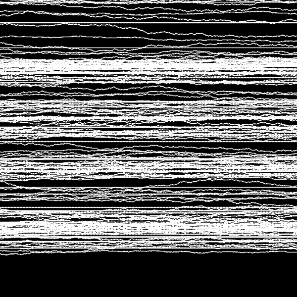

This sketch is based on the one presented in Ira Greenberg's called Razor Tooth Pattern, in the book "Processing - Creative coding and computational art". p.213,chapter 6.

I made this as a way to incorporate it in my webpage portfolio. 

Inspiration >

Result >

