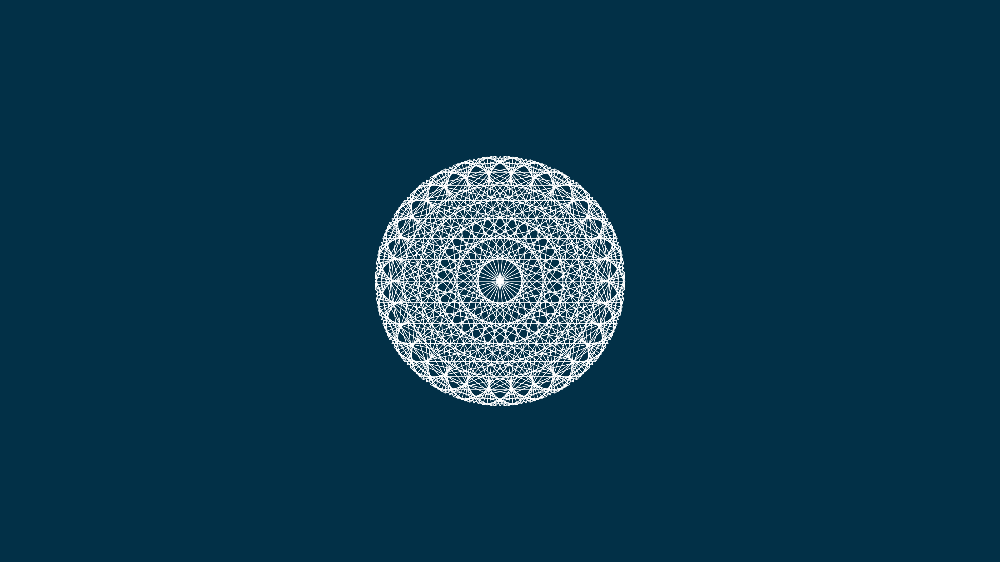
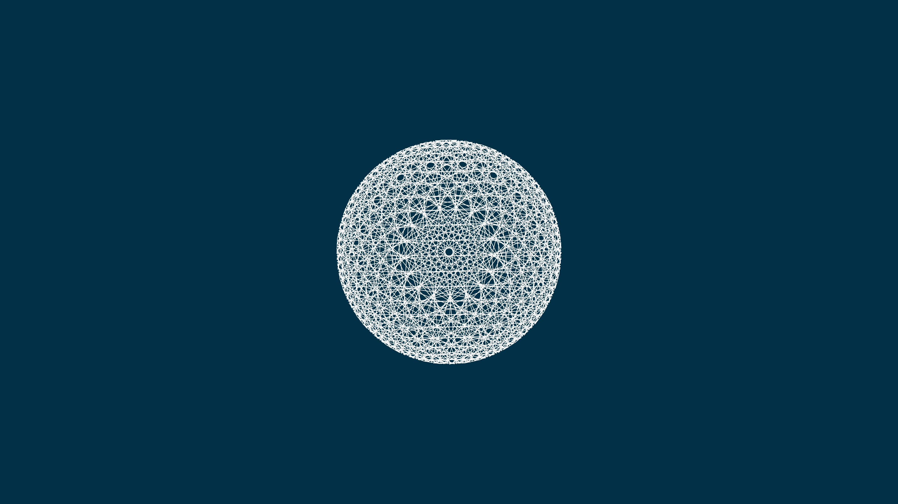

This is heavily based on the work of David Mrugala (thedotisblack), which is a youtube channel that shows how to code this pattern. 

I wanted to create it because I would be able to use it as wallpaper and learn more about the specific differences in wtiting the solutions vs what I would do. 

This is the original video.

RESULT >

