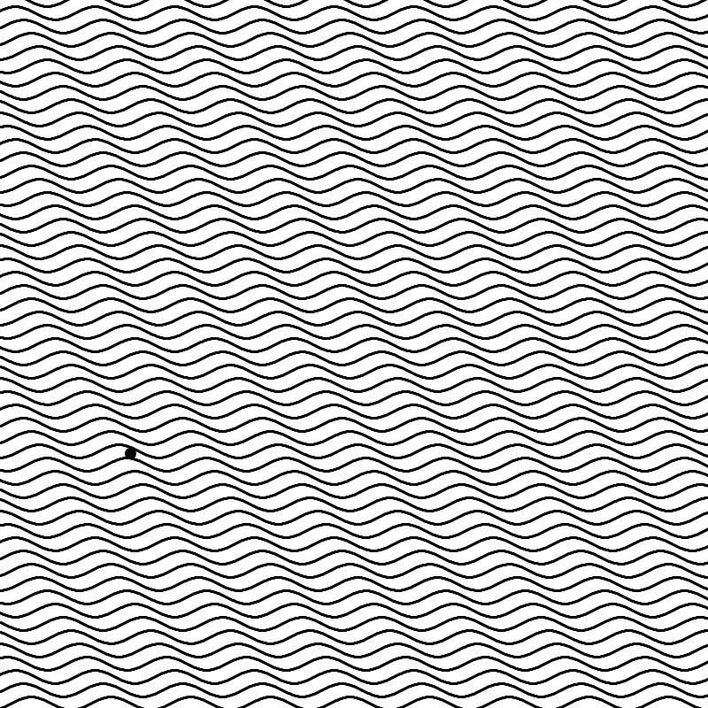

In this pattern what I did was replicate the code I saw in the book I'm studying: Processing Creative coding and computational art, by Ira Greenberg, but I tried to do so just based in the final outcome, without typing the code exactly as the author. 

Important thing to notice in this code is the use of mouseX and mouseY to control the parameters of the trig function. 
I modified the amplitude and phase of the wave by taking the mouseX and mouseY events, so the values were dynamically changed and I could get a rapid visual of the results. 

A next step would be to record all the wave parameters from interesting visuals so I can replicate them in the more static sine_pattern sketch.

