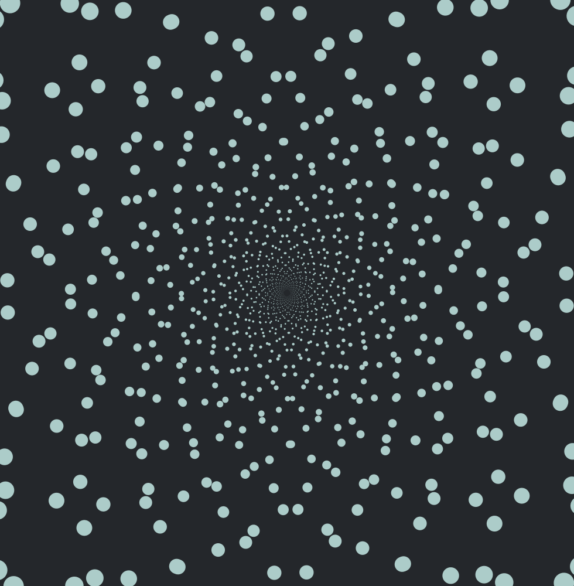

I found this pattern while looking for info about how to animat optical art. I found it stunning and I hope at some point to integrate it into another project.

Result >

Reference: 
Skecth originally created by David Mrugala (thedotisblack), as seen in his youtube account.

https://www.youtube.com/watch?v=zYgfVHKgfpY

