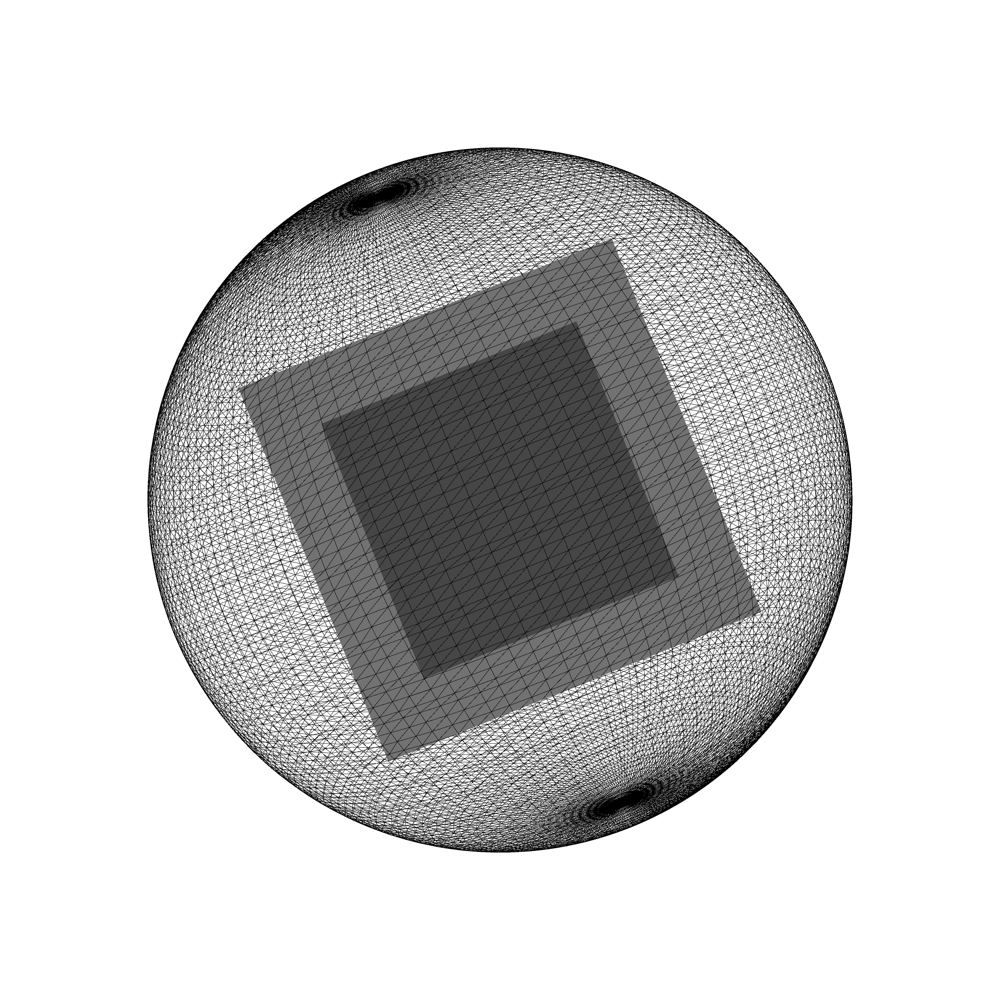

This is a reproduction of Ira Greenberg's sketch to represent a 3D polyhedra.
I just wanted to take the opportunity to use the P3D mode in processing. 

Processing: Creative coding and computational art, 2007. p.195

