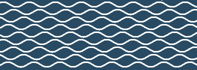

El objetivo de este sketch es crear patrones de Moiré con expresiones trigonométricas. 

Utilizando el contraste entre blancos y negros, la idea es jugar con las formas que surgen a partir de la variación sutil de la fase inicial de las ondas. 

